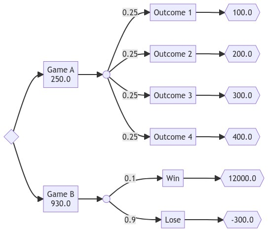

# Decision Trees

Example:

```python
from decisiontree.decisiontree import *

tree = DecisionTree(
    root=DecisionNode(
        decisions=[
            Decision(
                desc="Game A",
                node=ChanceNode(
                    chances=[
                        Chance(
                            desc="Outcome 1",
                            probability=0.25,
                            node=OutcomeNode(value=100.0),
                        ),
                        Chance(
                            desc="Outcome 2",
                            probability=0.25,
                            node=OutcomeNode(value=200.0),
                        ),
                        Chance(
                            desc="Outcome 3",
                            probability=0.25,
                            node=OutcomeNode(value=300.0),
                        ),
                        Chance(
                            desc="Outcome 4",
                            probability=0.25,
                            node=OutcomeNode(value=400.0),
                        ),
                    ],
                ),
            ),
            Decision(
                desc="Game B",
                node=ChanceNode(
                    chances=[
                        Chance(
                            desc="Win",
                            probability=0.1,
                            node=OutcomeNode(value=12000.0),
                        ),
                        Chance(
                            desc="Lose",
                            probability=0.9,
                            node=OutcomeNode(value=-300.0),
                        ),
                    ],
                ),
            ),
        ],
    ),
)
tree.write_jpg('demo.jpg')
```

Output:


